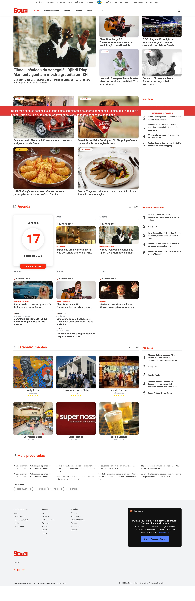

# Introdução

A cidade de BH tem diversos eventos, desde shows internacionais a palestras inspiradoras,
feiras culturais e exposições. Atualmente existem sites que divulgam os eventos para o público, como o SouBH, Sympla, e AgendaBH, para citar três de um número maior de opções gratuitas e bem atualizadas. No entanto, há uma clara lacuna na comunicação desses eventos para o público. As informações muitas vezes se perdem nas plataformas que não apresentam de forma eficiente a localização dos eventos, sendo pouco interativo com o usuário, apresentando muitas vezes em listas ou galerias de eventos conforme figura 1 do site SouBH. E o público potencial muitas vezes não consegue visualizar os eventos
que tem disponível próximo à ele.

## Problema

Os eventos são considerados como um acontecimento o qual reúne um público em um espaço físico com um objetivo em comum (ALVES, 2012). Além disso os eventos são categorizados em Culturais, Corporativos, Educacionais, Esportivos e Sociais que são definidos da seguinte forma:

Eventos Culturais - tem como objetivo proporcionar diversão e entretenimento ao público. Exemplo: festivais e shows musicais, exposições artísticas, festivais de gastronomia e festas.

Eventos corporativos - Costumam ser mais formais e geralmente são organizados por empresas ou instituições com objetivos variados, podendo visar o treinamento de colaboradores, e a criação de uma relação mais próxima com clientes, parceiros e novos consumidores ou usuários do produto ou serviço produzido pela empresa. Exemplos: feiras, conferências, reuniões e treinamentos.

Eventos educacionais - tem como objetivo o aprendizado e muitas vezes emite certificados. Tem como público alvo estudantes, pessoas que desejam uma especialização e profissionais. Exemplo: cursos, congressos, workshops, mesas redondas, palestras e seminários.

Eventos esportivos - tem como objetivo incentivar a prática de esportes e atividades físicas e podem ser voltados tanto para atletas amadores como profissionais. Exemplo: corridas, maratonas, campeonatos e jogos individuais.

Eventos sociais - tem como objetivos a diversão e a confraternização entre os presentes, mas não possui caráter comercial e são destinados a um público específico. Exemplos: festas, casamentos, happy hours, aniversários, churrascos e festas de formatura

Eventos possuem 3 fases:

- Pré-evento;
- Evento;
- Pós-evento.

## Objetivos

Criar uma aplicação Web onde o público possa explorar uma ampla variedade de opções de eventos culturais e sociais de forma democrática e não tendenciosa e não levando em conta o aspecto econômico (patrocínios). Sendo que o site deve permitir que o organizador possa cadastrar seus eventos de forma simples e eficaz. Além disso, o usuário deverá poder rastrear os eventos mais próximos ou de maior interesse, de forma a incentivar a participação e o engajamento ativo na vida da cidade, reforçando o senso de comunidade.

## Justificativa

O cenário atual da cultura e do entretenimento é de grande otimismo, com o retorno dos eventos após o período da pandemia. O setor de eventos emprega cerca de 3.205.550 (6,6% de empregos gerados no Brasil) pessoas, 2.734.441 MEI’s (18,3% do total de microempreendedores do país) e fatura anualmente cerca de R$291,1 Bilhões [2]. Em 2022, o segmento cresceu 400% em comparação com 2020, responsável por 4,32% do PIB brasileiro (NOGUEIRA, 2023).

Minas Gerais registrou a maior variação no volume das atividades turísticas em 2023, em comparação com 2022, e desponta como o estado brasileiro com maior crescimento no setor. De acordo com o Índice de Atividades Turísticas (Iatur), apurado pelo IBGE, a variação mineira foi de 24,3%, ficando 13,2 pontos percentuais acima da média nacional (11,1%) (NOGUEIRA, 2023).

Para a capital do estado de MG, onde está concentrada a maioria dos eventos, há a necessidade de um site de divulgação de eventos é evidente diante do crescente número de oportunidades de entretenimento e aprendizado que a cidade de BH oferece. O fato de não haver democracia no momento de divulgação de eventos, resulta em monopolização dos espaços para os eventos de maior porte. A aplicação Web VivaBH visa abordar essa lacuna, promovendo um ambiente mais participativo, estimulante e culturalmente rico.

O desafio que enfrentamos é como unir as diversas informações sobre eventos e apresentá-las de maneira coesa e acessível. Portanto, a criação de um site dedicado a aglutinar e destacar todos os eventos de forma democrática e clara para os usuários se torna fundamental.

## Público-Alvo

O público-alvo inclui estudantes em busca de atividades educacionais e profissionais interessados em networking, passando por famílias em busca de atividades para seus filhos e entusiastas culturais em busca de experiências enriquecedoras. Além disso, os próprios organizadores de eventos serão beneficiados, podendo atingir um público mais amplo e diversificado através dessa plataforma.
